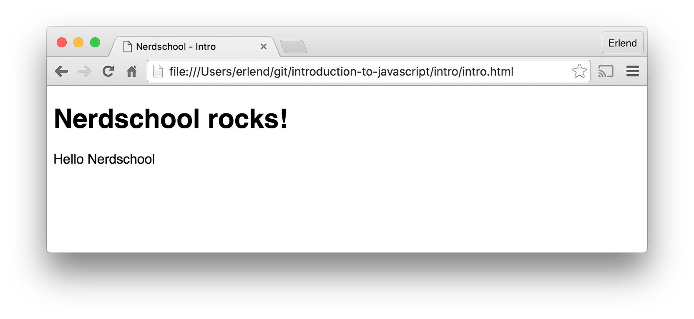

# Exercise 1 - Hello world
This exercise will get you started learning the basics of JavaScript in the browser.

You will learn how to:
 1. Set up your development environment
 2. Create "Hello world"
 3. Make your code interact with the webpage

## 1. Dev environment

> **Before you begin**: Please make sure that you have the following installed:
-  Google Chrome: [https://www.google.com/chrome](https://www.google.com/chrome)
-  A code editor

* Open `intro.html` both in Chrome and your code editor. Make sure changes to the HTML file are reflected in the browser.

## 2. "Hello world"

To make our example web page run JavaScript we need to add a `<script>` element.
* Add the following `<script>` element just before the closing `</body>` element:

```html
<script>
  alert('Hello world!');
</script>
```

* Refresh your page (hit `F5` or `CTRL+R`/ `CMD+R`).

The result should be a box popping up saying 'Hello world!'. How exciting!


> **Note:** Declaring scripts directly in HTML inside a `<script>`-tag is not good considered good practice, in later exercises we will be doing all coding inside external `.js` files loaded into the page.

## 3. Interacting with the DOM

All browsers supply an API called the DOM (Document Object Model). The DOM API gives developers access to manipulate the webpage markup dynamically via a tree structure called the _DOM tree_. Each HTML element in the webpage is represented as a node in the tree.

We are going to use a DOM API method called `querySelector` to replace some text in the webpage, but we need to think about the order we do things.

* Replace the contents of the `<script>` element we created in the last example with the following code:

```javascript
var paragraph = document.querySelector('p');
paragraph.innerHTML = 'Hello Nerdschool';
```

* Refresh the page in the browser.

Apparently nothing happened so it's time to take on our CSI hat.

* Open the browser developer tools (F12) and go to the Console tab. Refresh the page again.

```javascript
intro.html:13 Uncaught TypeError: Cannot set property 'innerHTML' of null
```

Looks like we're trying to set `innerHTML` on something that's `null`. It's not to hard to take a guess based on our code what the `null` thing is, but let's explore another debug tool while we're at it.

* Between the two existing lines, add the following:

~~~~javascript
console.log('The current paragraph is:', paragraph);
~~~~

* Refresh the page with the dev tools still open.

~~~~
The current paragraph is: null
~~~~

Well we already knew that, but becoming comfortable with `console.log()` is crucial. This is one of your primary tools of inspecting what's going on at runtime.

Ok so back to our problem of a null paragraph. Can you guess why this is happening?

No really, think about it a few second.

The DOM is read sequentially from top to bottom. As the code is now, our `<script></script>` block is executed before anything in the `<body>` is even read initially. So when we try to find a `<p>` element, none exists because the parser haven't found it yet.

* Make sure your `<script>` element is located below the `<p>` (paragraph) element. (Hint: the `<script>` block can live inside of the `<body>`).

* Refresh your page. The result should be the text 'Hello Nerdschool' displaying in the paragraph below the heading.

  

* Try replacing the text with something else, then refreshing the page.

### What happened here?

In the first line we query the DOM via the `document` object, passing in a _selector_ to find the first `<p>` element in the webpage. We then change the contents of the element by setting the `innerHTML` property.

### [Go to exercise 2 ==>](../exercise-2/README.md)
