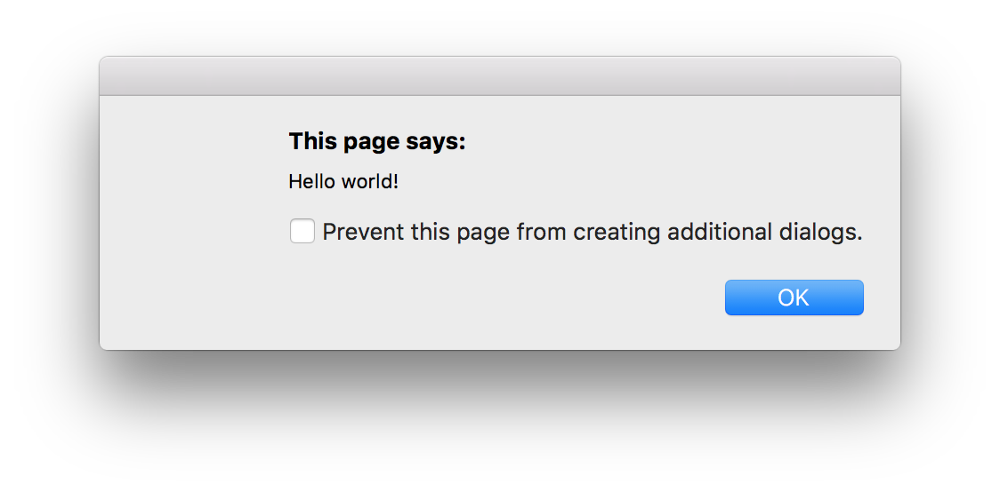
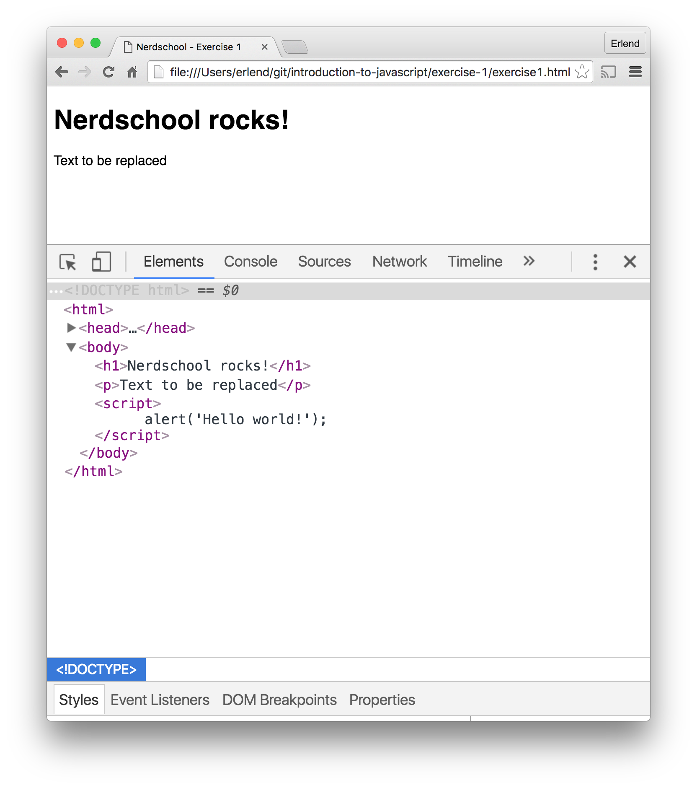

# Exercise 1 - Hello world

This exercise will get you started learning the basics of JavaScript in the browser.

You will learn how to:

- Set up your development environment
- Create "Hello world"
- Make your code interact with the web page

## Required software and tools for this exercise

- [Chrome](https://www.google.com/chrome)
- [Visual Studio Code](https://code.visualstudio.com)

## Before you start

- :pencil2: Start by cloning this repository into a folder on your computer if you haven't done so already. If you've never used git before, you can alternatively use the the "Download ZIP" button on the [repository home page](https://github.com/nerdschoolbergen/introduction-to-javascript/tree/master). Click the green "Code" button and then "Download Zip" 
- :book: Although you have this `README.md` file on your computer, it's easier to read it on GitHub with formatting. We therefore recommend you keep a web browser tab open with the exercise tasks.

## 1.1 - Dev environment

:pencil2: Open `exercise1.html` both in Chrome and Visual Studio Code. Make sure changes to the HTML file are reflected in the browser.

## 1.2 - "Hello world"

:pencil2: To make our example web page run JavaScript we need to add a `<script>` element.

:pencil2: Add the following `<script>` element just before the closing `</head>` element:

```html
<script>
  alert("Hello world!");
</script>
```

Refresh your page (hit `F5` or `CTRL+R`/ `CMD+R`).

The result should be a box popping up saying 'Hello world!'. How exciting!



> :exclamation: Declaring scripts directly in HTML inside a `<script>`-tag is not good considered good practice, in later exercises we will be doing all coding inside external `.js` files loaded into the page.

## 1.3 - Interacting with the DOM

All browsers supply an API called the DOM (Document Object Model). The DOM API gives developers access to manipulate the web page markup dynamically via a tree structure called the _DOM tree_. Each HTML element in the web page is represented as a node in the tree.

This is what the DOM structure of `exercise1.html` looks like, with the `script`-tag now located in the `<head>`-section (collapsed in image below).



We are going to use a DOM API method called `querySelector` to replace some text in the web page, but we need to think about the order we do things.

:pencil2: Replace the contents of the `<script>` element we created in the last example with the following code:

```javascript
var paragraph = document.querySelector("p");
paragraph.innerHTML = "Hello Nerdschool";
```

Refresh the page (hit <kbd>F5</kbd> or <kbd>CTLR</kbd> + <kbd>R</kbd> / <kbd>CMD</kbd> + <kbd>R</kbd>).

Apparently nothing happened so it's time to take on our detective hat 🕵️.

:pencil2: Open the Chrome or Firefox Devloper Tools by doing one of the following:

- **Using Google Chrome:** Select **More Tools > Developer Tools** from the Chrome Menu.
- **Using Firefox:** Select the hamburger menu at the top right corner of the browser, select `Web Developer` and click `Toggle Tools`.
- **Firefox/Chrome**: Right-click on a page element and select Inspect
- **Firefox/Chrome**: Use the keyboard shortcuts `Ctrl+Shift+I` (Windows) or `Cmd+Opt+I` (Mac)

:pencil2: Go to the Console panel. (Don't worry about all the other buttons and panels, we will revisit DevTools in the next exercise.). Refresh the page again.

```javascript
exercise1.html:13 Uncaught TypeError: Cannot set property 'innerHTML' of null
```

Looks like we're trying to set `innerHTML` on something that's `null`. It's not to hard to take a guess based on our code what the `null` thing is, but let's explore another debug tool while we're at it.

:pencil2: Between the two existing lines, add the following:

```javascript
console.log("The current paragraph is:", paragraph);
```

Refresh the page with the Console panel in DevTools still open.

```
The current paragraph is: null
```

Well we already knew that, but becoming comfortable with `console.log()` is crucial. This is one of your primary tools of inspecting what's going on at runtime.

Ok so back to our problem of a null paragraph. Can you guess why this is happening?

No really, think about it for a few seconds.

The DOM is read sequentially from top to bottom. As the code is now, our `<script></script>` block is executed before anything in the `<body>` is even read initially. So when we try to find a `<p>` element, none exists because the parser haven't found it yet.

:pencil2: Make sure your `<script>` element is located below the `<p>` (paragraph) element. (Hint: the `<script>` block can live inside of the `<body>`).

Refresh your page. The result should be the text 'Hello Nerdschool' displaying in the paragraph below the heading.


:pencil2: Try replacing the text with something else, then refreshing the page.

### :question: What happened here?

In the first line we query the DOM via the `document` object, passing in a _selector_ to find the first `<p>` element in the web page. We then change the contents of the element by setting the `innerHTML` property.

### [Go to exercise 2 ==>](../exercise-2/README.md)
