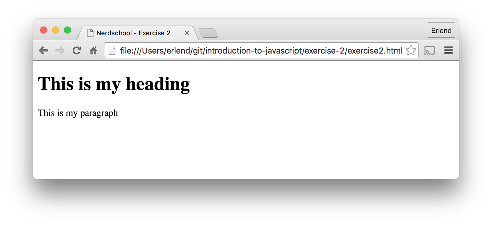
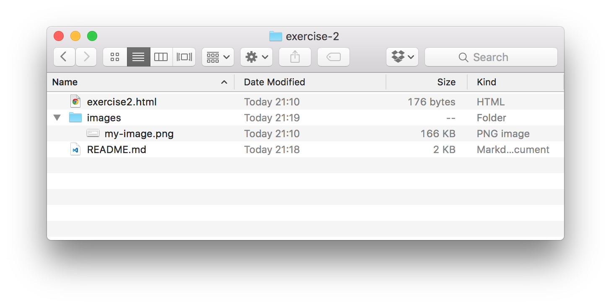
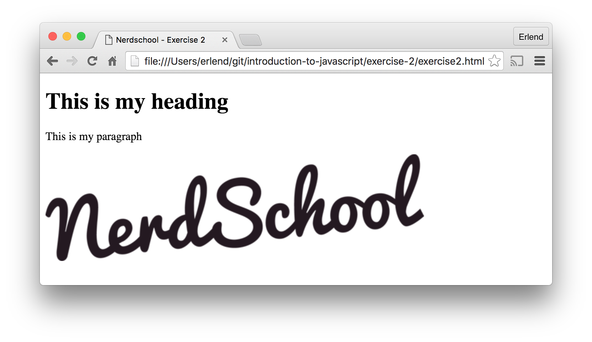
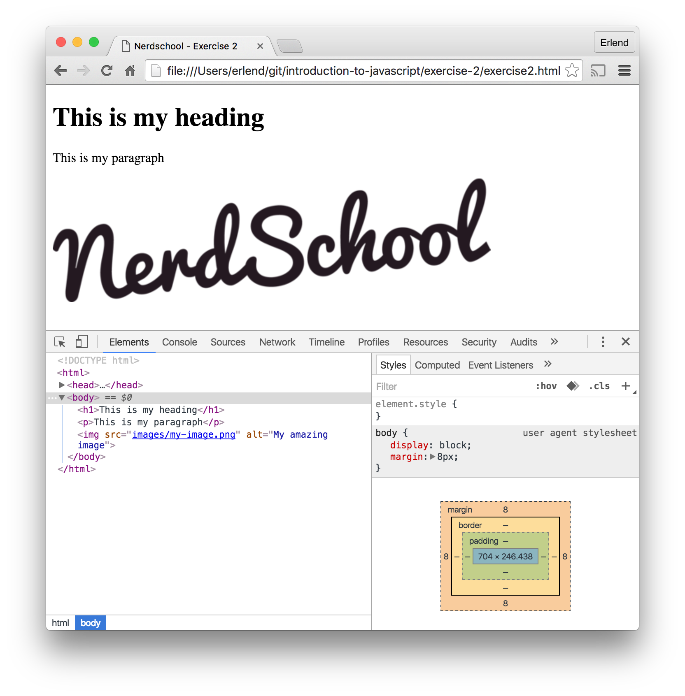

# Exercise 2: Anatomy of a web page

This exercise will get you started learning the anatomy of a web page with the help of Chrome DevTools.

You will learn how to:

- Write some basic HTML and insert an image into the page
- Use the _Elements_ panel in Chrome DevTools
- Create a separate file to contain your JavaScript code
- Use the _Network_ panel in Chrome DevTools

## Required software and tools for this exercise

- [Chrome](https://www.google.com/chrome)
- [Visual Studio Code](https://code.visualstudio.com)

## 2.1 - Writing some basic HTML

### What is HTML?

> :exclamation: HTML is a **markup language**. HTML separates "content" (words, images, audio, video, and so on) from "presentation" (instructions for displaying each type of content). HTML uses a pre-defined set of elements to define content types. Elements contain one or more "elements" that contain or express content. elements are enclosed by angle brackets, and the closing element begins with a forward slash. (developer.mozilla.org)

Basic HTML structure:

```html
<!DOCTYPE html>
<html>
  <head>
    <title>Title of my page</title>
  </head>
  <body>
    Some text
  </body>
</html>
```

- The `<!DOCTYPE html>` tag at the top tells the browser that we are using version 5 of the HTML standard.
- The `<html>` element surrounds all elements in the page.
- The `<head>` elements contains element that define meta data about the contents of the page, for instance the `<title>`.
- The `<body>` element surrounds the page content.

>  Read more about HTML here: https://developer.mozilla.org/en-US/docs/Web/Guide/HTML/Introduction

### 2.1.1 - Adding a heading and a paragraph

:pencil2: Open `exercise2.html` in Chrome and in your code editor.

:pencil2: Locate the empty `<body>`-element. This is where we will be adding some markup.

:pencil2: To create a main heading for the page, add a `<h1>`-element with the text "This is my heading" inside the `<body>` element.

:pencil2: Next we will add a paragraph of text under the heading. Add a `<p>`-element with the text "This is my paragraph" underneath the previous `<h1>`-element.

:pencil2: Refresh the page in the browser. The result should look something like this:



>  Read more about the heading and paragraph elements here:

- https://developer.mozilla.org/en-US/docs/Web/HTML/Element/p
- https://developer.mozilla.org/en-US/docs/Web/HTML/Element/Heading_Elements

### 2.1.2 - Adding an image

:pencil2: Download an image of your choice (GIF/PNG/JPG) and rename the file something more sensible.

:pencil2: Create a sub folder called `images` inside the folder containing `exercise2.html`

:pencil2: Move your image file into the `images` folder. The resulting folder structure should look like this:


:pencil2: To display the image in the web page, we need to add an `` element. The img element does not have a closing element. **Note the `/` at the end of the element**:

```html

```

If you refresh the browser, no image will be displayed yet. We need to set the `src` attribute to the relative path of the image in the `images` folder on your computer:

```html

```

> :exclamation: The `alt` attribute ("Alternate text") is used to specify a descriptive text that should be displayed if the image cannot be loaded. It is also important for accessibility (screen readers).

:pencil2: Refresh the page. The result should be something like this:


> :exclamation: Having trouble displaying the image? Double check that the the path to the file in the `src` attribute is correct. Also verify that the syntax of the `` element is correct. Still not working? Open the _Console_ panel in Chrome DevTools like in Exercise 1 to debug.

>  Read more about the image element here: https://developer.mozilla.org/en-US/docs/Web/HTML/Element/img

## 2.2 - Chrome DevTools &ndash; The _Elements_ panel

We can use the Elements panel in Chrome DevTools to make changes to the DOM (and CSS) on the fly in the browser.

:pencil2: Open the Chrome Dev Tools by doing one of the following:

- Select **More Tools > Developer Tools** from the Chrome Menu.
- Right-click on a page element and select Inspect
- Use the keyboard shortcuts `Ctrl+Shift+I` (Windows) or `Cmd+Opt+I` (Mac)

You should now see the _Elements_ panel displaying the DOM tree of your page:


:pencil2: Try moving the mouse pointer over some of the elements. The corresponding section of the web page will "light up" to tell you where the element currently selected is located in the layout of the page.

:pencil2: Try using the up and down arrow keys to navigate up and down the DOM tree.

:pencil2: Try editing the heading by first selecting the `<h1>` element in the DOM tree view and then double click on the text "This is my heading". Type something and press enter to stop editing and display the changes in the web page.

> :book: Read more about the _Elements_ panel in DevTools here: https://developers.google.com/web/tools/chrome-devtools/inspect-styles/

## 2.3 - Creating and loading an external `.js` file

In Exercise 1 we created some simple JavaScript inside a `<script>` element in the web page. Now we´ll look at creating a separate `.js` file for our JavaScript code. This makes the code reusable, as we can link to the same script from multiple pages and share the script with others.

:pencil2: Start by creating a `scripts` folder inside the folder where `exercise2.html` is located.

:pencil2: Create a file called `exercise2.js` inside the `scripts` folder you just created.

:pencil2: Add the following code to the `exercise2.js` file

```javascript
alert("Hello from an external JavaScript file!");
```

:pencil2: To make your web page load this script, we need to add a `<script>` element with an `src` attribute (like we did with the image):

```html
<script src=""></script>
```

:question: Can you guess what the value of the `src` attribute needs to be in order to load your script? Hint: Take a look at the image source path.

:pencil2: Refresh the web page and you should now see an alert box with the text "Hello from an external JavaScript file!".

> :book: More info about the `<script>` element here: https://developer.mozilla.org/en-US/docs/Web/HTML/Element/script

## 2.4 - Chrome DevTools &ndash; The _Network_ panel

Lastly we will take a look at the _Network_ panel in Chrome DevTools. The Network panel lets you look at a timeline of what resources are loaded when you load the web page, such as the page itself, scripts, images, videos and
background HTTP requests.

:pencil2: Open the following URL in Chrome: https://jsbin.com/luyixutage

:pencil2: Open the Chrome Dev Tools by doing one of the following:

- Select **More Tools > Developer Tools** from the Chrome Menu.
- Right-click on a page element and select Inspect
- Use the keyboard shortcuts `Ctrl+Shift+I` (Windows) or `Cmd+Opt+I` (Mac)

:pencil2: Select the _Network_ panel. Notice that the panel is empty. This is because we need to have the panel open when the page loads in order to record network activity. Press `CTRL+R` (Windows) or `CMD+R` (Mac) to refresh the page and record.

:pencil2: You should now see a list containing multiple requests. A short description of some of the columns in the list:

- Method: The HTTP Verb (GET, POST, PUT, etc.) used in the request
- Status: The current status of the request (200, 404, 500, etc.)
- Type: The type of the requested resource (png, script, document, stylesheet)
- Size: The size of the response
- Time: The total duration of the request

:pencil2: The page contains a request to a image called `fire.gif`. See if you can locate the request in the list:

- How big is the image?
- How long did it take to download the image?
- What is the status of the request?

:pencil2: Open the following page: http://output.jsbin.com/rezuhiv

:pencil2: Follow the steps above to record network activity

:question: Can you spot what's wrong by looking at the list of requests? (Hint: Errors are light-red).

- What is the status code of the failed request?

> :book: Read more about the _Network_ panel in DevTools here: https://developers.google.com/web/tools/chrome-devtools/network-performance/resource-loading

### [Go to exercise 3 ==>](../exercise-3/README.md)
