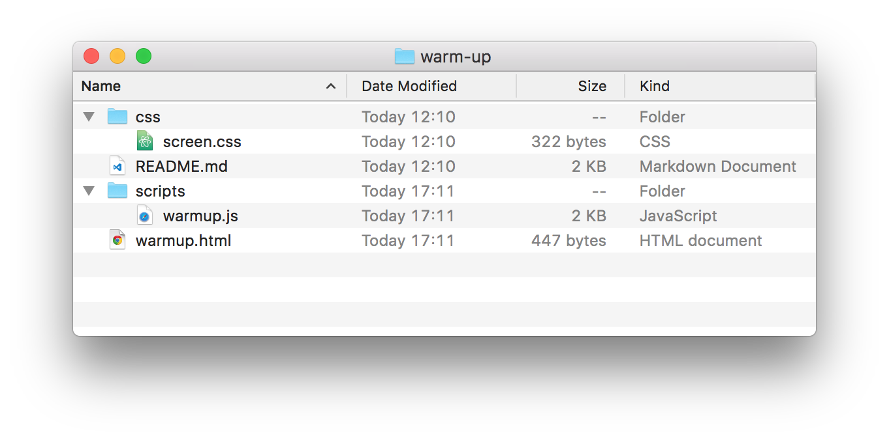
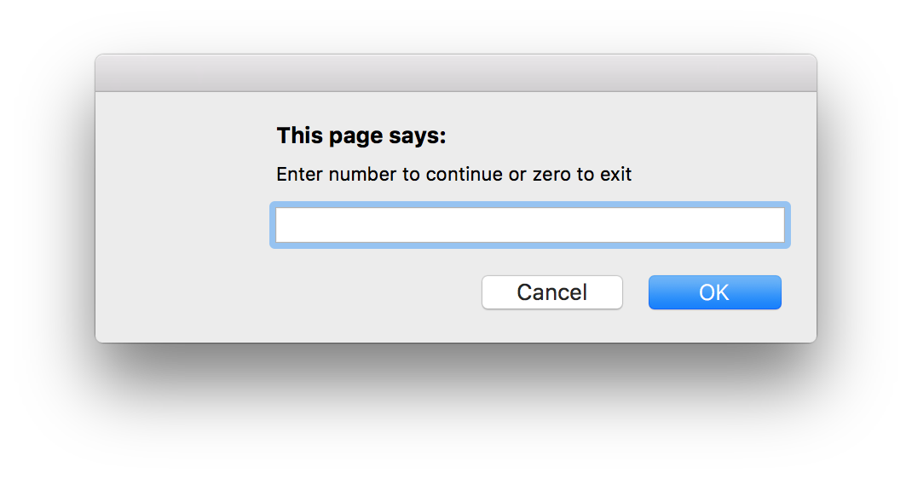
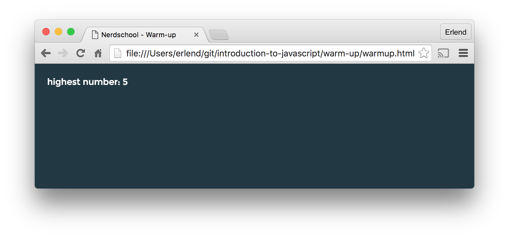
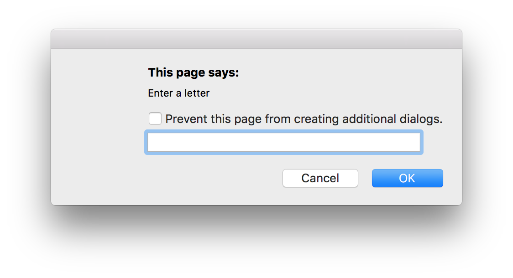
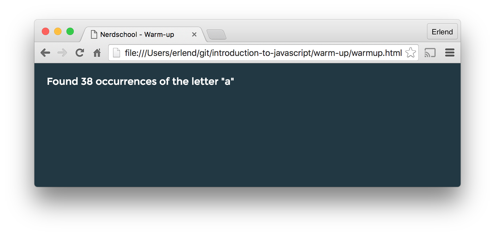

# Warm-up exercises

You will need to interact with the browser a bit to prompt the user to give input and to write the result to the screen.

## 1. Code snippets

Here are some examples to get you started:

**Getting user input**:
```javascript
var input = prompt('Enter something here'); // Displays a pop-up input box in the browser
```

**Writing to the document/page:**
```javascript
document.write('Warm-up!'); // Writes to the document/page
```

For more examples, see [javaScriptCheatSheet.js]('../javaScriptCheatSheet.js')

## 2. Preparation

* In the `scripts` folder, create a new file named `warmup.js`. The folder structure should look like this:
  
* In `warmup.html`, add a script tag in the `<body>`. A script tag example:

  ```javascript
    <script src="path/to/.js/file"></script>
  ```
* Open `warmup.html` in your browser and start coding!

## 3. Exercise &ndash; Find the highest number

The goal of this exercise is to continuously prompt the user for a number and remember the highest number found until the user enters zero:



The resulting number should be printed to the screen:



* Inside `warmup.js`, create a function named `findHighestNum` which takes no parameters. Call the function at the bottom of the script:
```javascript
function findHighestNum() {
    // your code here
}
// call findHighestNum function when page is loaded:
findHighestNum();
```
* Create a `while`-loop inside `findHighestNum` that calls `prompt` and stores the input in a variable. Tip: You probably need to convert the input _string_ to a _number_ of some kind. See the [javaScriptCheatSheet.js]('../javaScriptCheatSheet.js')
* When zero is entered, the loop should exit and it should print the highest number to the screen.
* Stuck in an endless loop? Make sure your `while` loop condition actually _can_ evaluate to `false`

## 4. Exercise &ndash; Count letters in text

The goal of this exercise is to prompt the user for a letter and count the number of occurrences of the inputted letter in a predefined text:



The letter count should be printed to the screen:


* Inside `warmup.js` delete all code from the previous exercise.
* Create a function named `countLetters` which takes no parameters.
* Go to http://www.lipsum.com/feed/html and copy a paragraph of dummy text from the page. It doesn't matter which one.
* Inside the function, create a variable to hold the text.
* Prompt the user for input, which should be a single letter. This value, if valid, should be given as parameter to the function you create next:
* Inside the function, create a new function named `countLetter` which takes one parameter named `letter`.
* Inside `countLetter`, find the number of occurrences of the letter given as parameter. Tip: using `var characters = text.split('');` will give you the chars in a string which you can then iterate over and check for matches.
* Print the number of occurrences to the screen.
